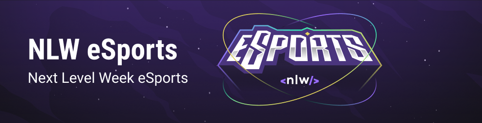
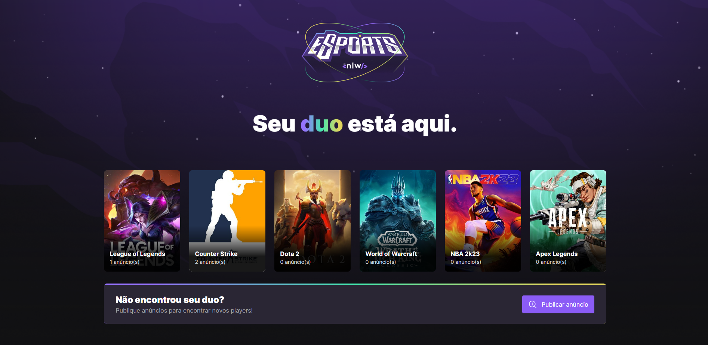
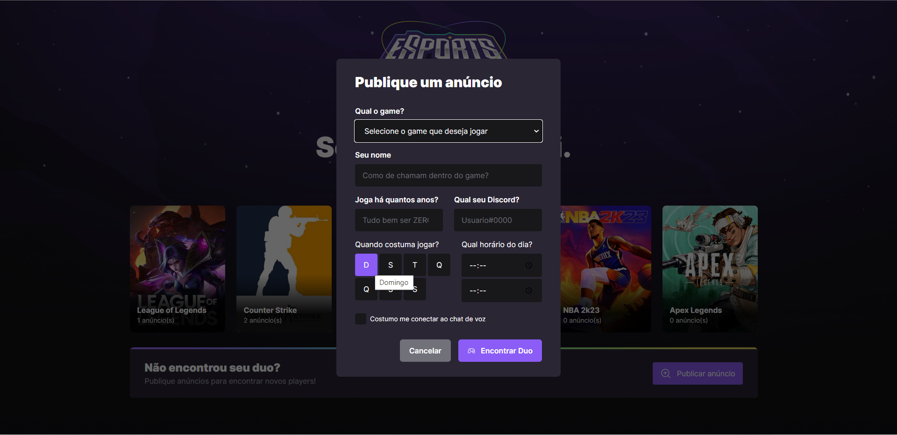
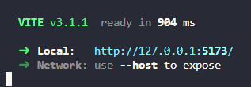

# NLW eSports - Find Your Duo
### Aplicação completa desenvolvida para proposcionar que o usuário gamer possa encontrar um parceiro para game pré-definido.




# Pré-requisitos

Antes de começar, você vai precisar ter instalado em sua máquina as seguintes ferramentas:
[Git](https://git-scm.com), [Node.js](https://nodejs.org/en/).  
Além disto é bom ter um editor para trabalhar com o código como [VSCode](https://code.visualstudio.com/)


## Rodando o Front End (Pagina web)
```bash
# Clone este repositório
$ git clone <https://github.com/anapaulabio/FindYourDUO>

# Acesse a pasta do projeto no terminal/cmd
$ cd FindYourDuo

# Vá para a pasta server
$ cd web

# Instale as dependências
$ npm install

# Execute a aplicação em modo de desenvolvimento
$ npx vite

# Acesse o link fornecido 
```


## Rodando o mobile 

```bash
# Em seu celular faça download do app Expo pelo Play store ou Apple store

# Acesse a pasta do projeto no terminal/cmd
$ cd FindYourDuo

# Vá para a pasta server
$ cd mobile

# Instale as dependências
$ npm install

# Execute a aplicação em modo de desenvolvimento
$ npm run start

# Acesse o QR code fornecido 
```

## Rodando o Back End (Servidor)

```bash

# Acesse a pasta do projeto no terminal/cmd
$ cd FindYourDuo

# Vá para a pasta server
$ cd server

# Instale as dependências
$ npm install

# Reinicie o Banco de Dados
$ npm prisma generate

# Visualize o Banco de Dados
$ npm prisma studio

# Execute a aplicação em modo de desenvolvimento
$ npm run dev

# O servidor inciará na porta:3333 - acesse <http://localhost:3000>
```


# 🛠 Tecnologias

As seguintes ferramentas foram usadas na construção do projeto:

        


# Autora


 
 <h3><b>Ana Paula Oliveira 🚀</b></h3>
 
 <h3>Feito com ❤️!👋🏽 Entre em contato!</h3>  
 <h1> <a href="https://www.linkedin.com/in/anapaulaoliveiraa" target="_blank"></a> </h1>


